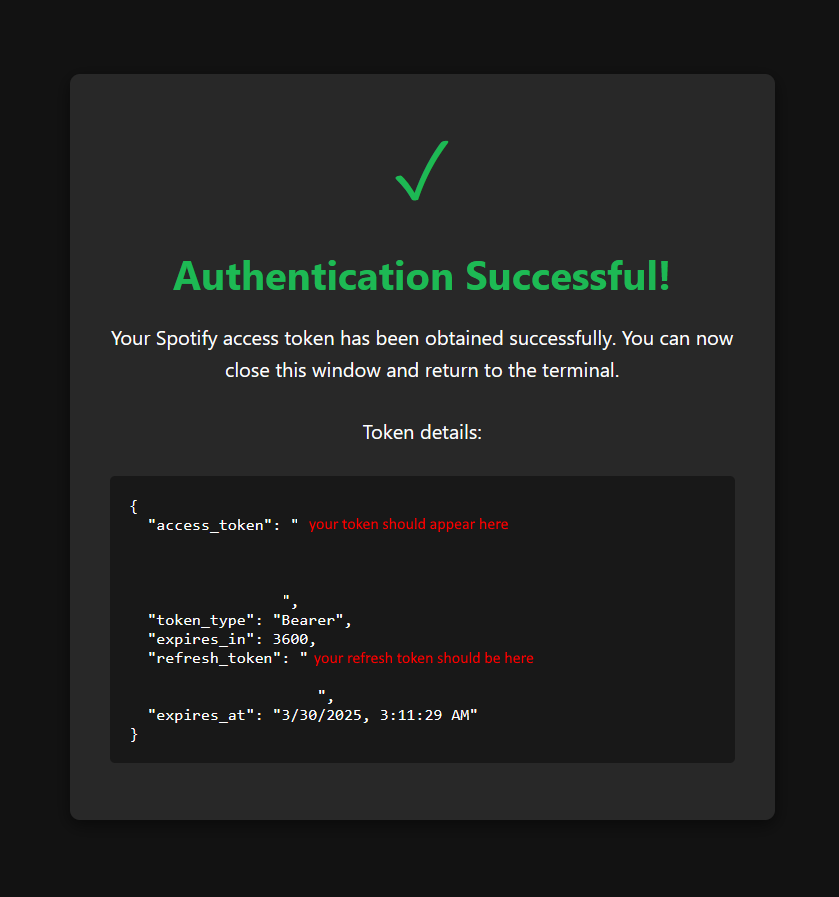

# Spotify Authentication Server

This typescript/node application is designed to facilitate the authentication process with Spotify's API using the Authorization Code flow. It provides a simple way to obtain access and refresh tokens, which can be used to make authorized requests to Spotify's endpoints.
As a standalone application, it can be run locally or deployed to a server, making it versatile for various use cases. But it is of limited use alone, and should be integrated into a larger application to be useful.



## Features

- Uses the Authorization Code flow (more secure than Implicit Grant)
- Handles the callback URL automatically with an Express server
- Obtains both access and refresh tokens
- Saves tokens to a file for easy access in your application
- Includes protection against CSRF attacks with state verification
- Displays a nice success page with token details
- Automatically opens the browser to start the authentication flow

## Prerequisites

- Node.js 16+ installed
- A Spotify Developer account with registered application
- Properly configured .env file with your Spotify credentials

## Setup

1. **Install dependencies**

```bash
npm install
```

2. **Configure your .env file**

Ensure your .env file contains the following variables:

```
SPOTIFY_CLIENT_ID="your-client-id"
SPOTIFY_CLIENT_SECRET="your-client-secret"
SPOTIFY_REDIRECT_URLS="http://localhost:3030/api/spotify/callback, https://your-production-domain.com/api/spotify/callback"
PORT=3030
```

3. **Important Note on Redirect URIs**

Make sure that one of your registered redirect URIs in your Spotify Developer Dashboard matches exactly what you've set in your .env file. For local development, this should be:

```
http://localhost:3030/api/spotify/callback
```

## Usage

Run the authentication server:

```bash
npm start
```

The script will:

1. Start an Express server on the configured port
2. Open your default browser to begin the Spotify authorization process
3. Handle the callback automatically when Spotify redirects back to your application
4. Display a success page in the browser with token details
5. Save the tokens to a file named `spotify-tokens.json`
6. Output the token information to your console

## Token Information

After successful authentication, you'll receive:

- **Access Token**: Used to make API requests to Spotify
- **Refresh Token**: Used to get a new access token when it expires
- **Expiration Time**: When the access token will expire (typically 1 hour)
- **Token Type**: Usually "Bearer" for use in Authorization headers

## Using the Tokens in Your Application

You can read the tokens from the generated `spotify-tokens.json` file:

```typescript
import * as fs from 'fs';

// Read tokens from file
const tokenData = JSON.parse(fs.readFileSync('spotify-tokens.json', 'utf8'));

// Use access token for Spotify API requests
const accessToken = tokenData.access_token;

// Make a request to Spotify API
const response = await fetch('https://api.spotify.com/v1/me', {
  headers: {
    'Authorization': `Bearer ${accessToken}`
  }
});
```

## Security Considerations

- The tokens are sensitive information and should be kept secure
- Never commit the tokens or .env file to version control
- Consider implementing token refresh logic for production applications
